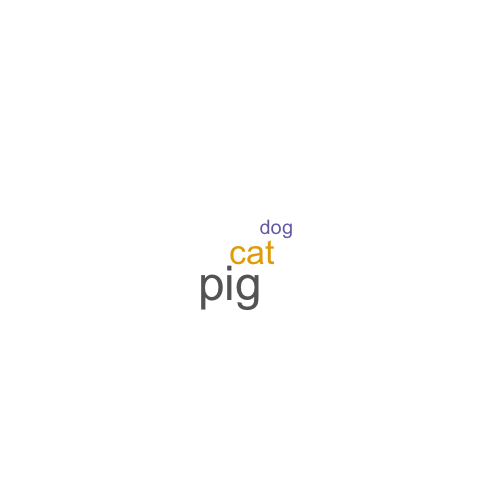

Shiny Chat with Word Frequency
========================================================
author: Wee Young Chua
date: 26 September 2015

Summary
========================================================
class:main-slide
This is a shiny application that contains the following function.
- Chat Application that tracks the chat since the creation
- Word Frequency of words that has been typed in the chat

Chat Application
========================================================
class:sec-slide
- Chat history is stored in file chat.Rds
- Chat text input goes into chat history etc
- Observe and sessions are being used
- Only shows the last 300 lines

Word Frequency
========================================================
class:sec-slide
- memoise is used to cached the words
- word history is stored in file words.Rds
= Chat text input goes into words.Rds and the word frequency is calculated
Using wordcloud_rep
- This can be shown here using 2 cat, 1 dog and 3 pigs (words)
 

Chat Application and Word Frequency
========================================================
class:sec-slide
- Chat application allows user to interact with each other. 
- Using word Frequency, we would be able to understand how user speaks
and interact with each other
- Over time, we would be able to predict and determine user behavior

Copyright by Wee Young, Chua 

